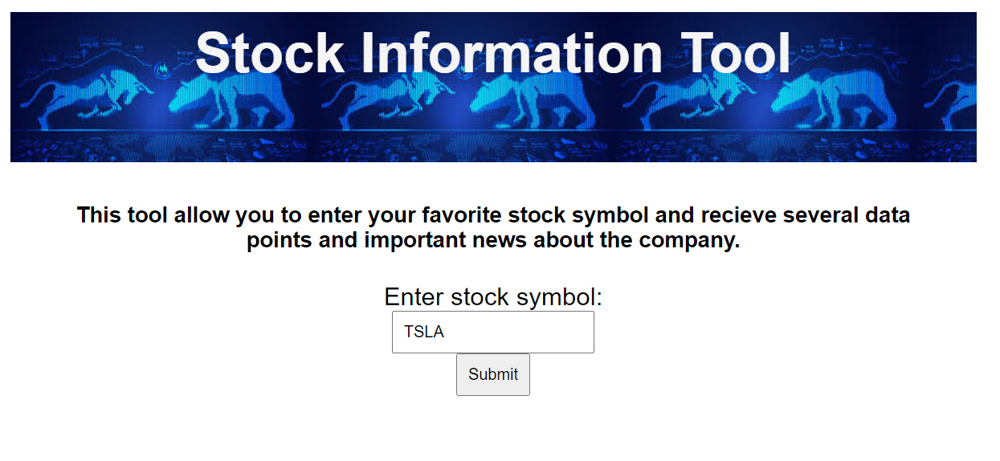

# 9-ApiHack-Cap

Stock Information Tool

https://andrethedeveloper.github.io/9-ApiHack-Cap/

This tool allows users to enter a stock symbol and receive useful information about the company.  The information provided includes an overview, a list of peers, and a list of recent news articles.

The technology used was HTML, CSS, and Javascript.

